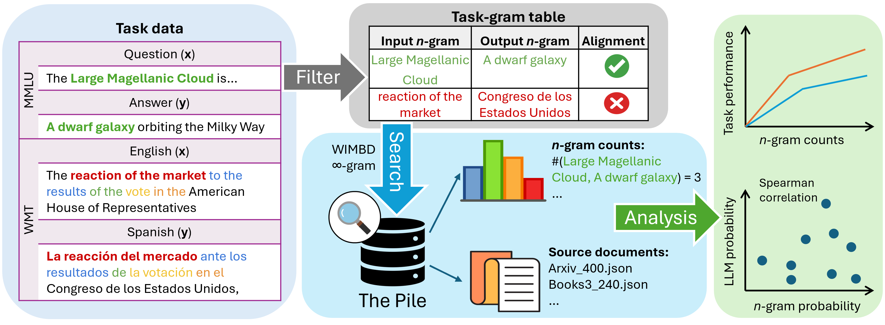

### Code for the paper [Generalization v.s. Memorization: Tracing Language Models' Capabilities Back to Pretraining Data](https://arxiv.org/abs/2407.14985)



<p align="center">
<b>Overview.</b> We construct an n-gram table for each downstream task by matching semantically similar n-grams with the pretraining corpus (PILE). We then analyze the LLM predictions and their relationship to the table.
</p>

### Environment Setup

Install the wimbd repo, and checkout the commit that I used.
```bash
git clone git@github.com:allenai/wimbd.git
cd wimbd
git checkout 0b787c31f856a512f6289657eef10f852b2f936e
cd ..
```

Once you pull the repo, refer to `requirements.txt` file to install the dependencies.

### Searching for N-grams in PILE

NOTE: To access the WIMBD database, you will need to fill in the form found here: https://wimbd.apps.allenai.org
Alternatively, you can use the InfiniGram API, by specifying the `--type infini` flag.

Here is an example of how to search for n-grams from some subtasks from MMLU in PILE.

```bash
CUDA_VISIBLE_DEVICES=1 python wimbd_search.py \
                        --type infini \
                        --corpus pile \
                        --n_grams 2 \
                        --dataset mmlu \
                        --replace_keywords false \
                        --filter_stopwords true \
                        --only_alpha false \
                        --name exp5 \
                        --align_pairs true \
                        --tasks marketing \
                                management \
                                high_school_world_history \
                                high_school_european_history \
                                miscellaneous \
                        --method common
```

## Citation

```bibtex
@misc{wang2024generalizationvsmemorizationtracing,
title={Generalization v.s. Memorization: Tracing Language Models' Capabilities Back to Pretraining Data},
author={Xinyi Wang and Antonis Antoniades and Yanai Elazar and Alfonso Amayuelas and Alon Albalak and Kexun Zhang and William Yang Wang},
year={2024},
eprint={2407.14985},
archivePrefix={arXiv},
primaryClass={cs.CL},
url={https://arxiv.org/abs/2407.14985},
}
```
